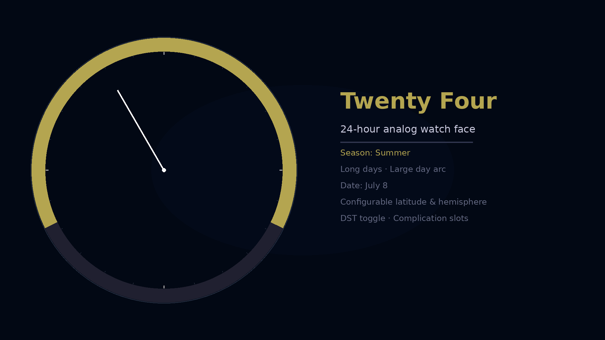
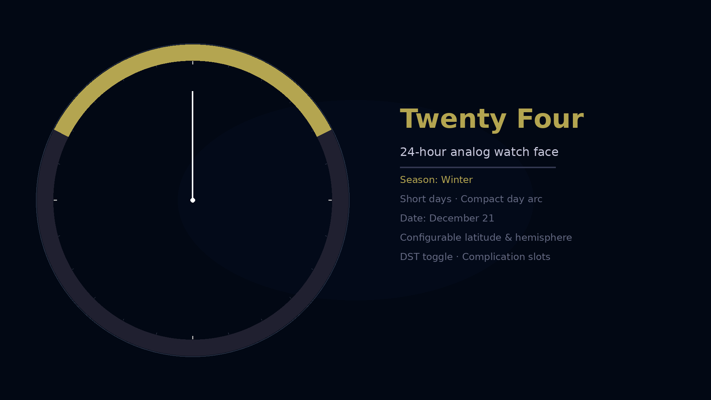

# Twenty Four

Note: send me a dm if you'd like me to add you as an internal tester on Google Play Store. I need test users.

A 24-hour analog watch face for Wear OS, built with [Watch Face Format](https://developer.android.com/training/wearables/wff) (WFF).

The hand completes one full rotation per day — midnight at the bottom, noon at the top. A seasonal arc shows the current day's daylight window, computed from a piecewise-linear approximation of the solar hour angle. The arc grows and shrinks with the seasons, giving you an at-a-glance sense of where you are in the day relative to sunrise and sunset.




---

## Features

- **24-hour hand** — one rotation per day, so the hand's position reflects true solar time at a glance
- **Seasonal day/night arc** — golden arc spans sunrise to sunset; updates daily based on day of year
- **Configurable latitude** — seven presets from ~25° (tropics) to ~65° (arctic)
- **Hemisphere toggle** — flip the arc for southern hemisphere users
- **DST toggle** — shifts the arc by 15° (one hour) during daylight saving time
- **Three complication slots** — a wide pill slot at noon and two circular slots at 9 PM and 3 AM; supports SHORT\_TEXT, LONG\_TEXT, MONOCHROMATIC\_IMAGE, and SMALL\_IMAGE types

---

## Configuration

| Setting | Options | Default |
|---|---|---|
| Latitude | ~25° (Tropics), ~35° (Subtropics), ~45° (Temperate), ~50°, ~55°, ~60°, ~65° (Arctic) | ~45° |
| S. Hemisphere | On / Off | Off |
| Daylight Saving Time | On / Off | On |

Configuration is available through the watch face editor on the watch or via the Wear OS companion app.

---

## How the arc works

The solar hour angle ω at a given latitude φ and day of year d is:

```
ω = arccos(−tan φ · tan δ)
```

where δ is the solar declination. Rather than computing this at runtime (WFF has no trig functions), the arc endpoints are approximated by a piecewise-linear function fitted at five breakpoints (solstices, equinoxes, and year boundaries) for each latitude preset.

The sunrise angle on the 24-hour face equals −ω and the sunset angle equals +ω, with noon at 0° (top) and midnight at ±180° (bottom).

For the southern hemisphere, the arc is reflected: ω\_south = 180° − ω\_north.

---

## Build

Requires Android SDK with Wear OS support and Java 21.

```bash
./gradlew assembleDebug
```

Install to a connected Wear OS device or emulator:

```bash
adb install watchface/build/outputs/apk/debug/watchface-debug.apk
```

Build a signed release bundle:

```bash
./gradlew bundleRelease
```

Signing credentials are read from `keystore.properties` at the project root (not committed — see `keystore.properties` format in `watchface/build.gradle.kts`).

---

## Requirements

- Wear OS 4 (API 33+)
- Pixel Watch or compatible round Wear OS device
